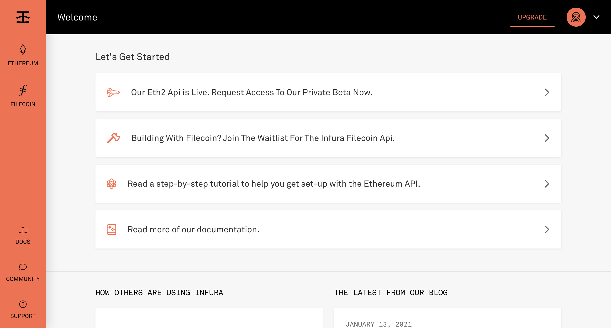
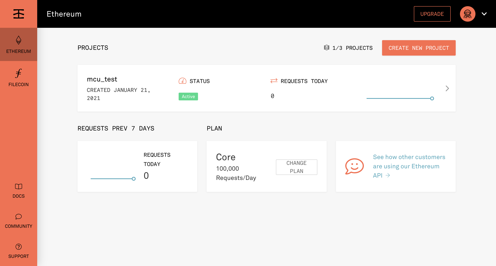
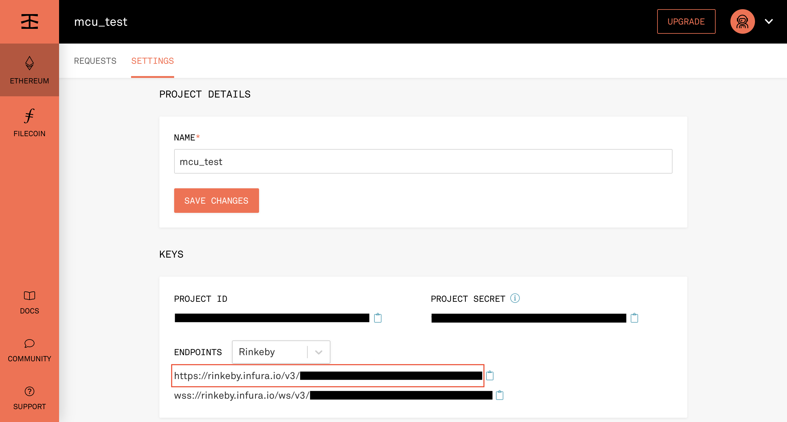

# Infura 教學

1. 註冊 [Infura 帳號](https://infura.io/register) (若已擁有，可略過此步驟)

2. 登入 [Infura](https://infura.io/login)

3. 點選左側欄的 ETHEREUM
   

4. 點選 CREATE NEW PROJECT
   

5. 輸入專案名稱，點選 CREATE
   

6. 請在 ENDPOINTS 選單中選擇 Rinkeby 測試鏈，並且將 URL 複製貼上到設定檔 [config.h](../example/spo-client-example/config.h) 中的 `nodeURL` 欄位
   

